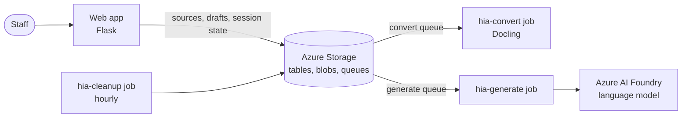

# Build-a-HIA

A [Helpful Information App](https://github.com/rodekruis/helpful-information) (HIA) is a public website where a Red Cross or Red Crescent National Society tells people affected by a crisis which humanitarian services it offers and how to reach them. Its content lives in a Google Sheet with categories, sub-categories, offers (services) and questions with answers.

Filling that sheet by hand from guidance documents, service lists and web pages can take days. **Build-a-HIA** drafts it with AI: staff upload the documents and web pages they already have, and the app proposes a structure and writes the content, citing a source passage for every fact. Staff review and correct everything before they download a workbook to copy into their HIA sheet. Nothing is published automatically.

## How it works

1. **Context**: describe the crisis, target group, locations and the output language.
2. **Sources**: upload PDFs, Word, Excel or image files, or add single web pages. Each source is converted to text in the background, with OCR for scanned pages.
3. **Structure**: the AI proposes categories and sub-categories from the sources. Staff rename, move, merge or remove them, or ask the AI to revise, then approve.
4. **Content**: the AI writes the offers and questions for each sub-category. Facts must cite a source passage; anything the sources do not support is left blank and reported as a gap.
5. **Review**: staff check each sub-category against the cited evidence, edit it and approve it. Gaps (missing, conflicting or outdated information, failed sources) get a status, a suggested action and a contact.
6. **Download**: `hia.xlsx` in the HIA template layout, ready to copy into the HIA sheet, and `review-internal.xlsx` with gaps, evidence and sources for internal follow-up.

Work happens in a temporary, anonymous session: there are no accounts, and all documents and drafts are deleted after 2 hours of inactivity or 24 hours at the latest.



The web app only handles pages and quick actions. Slow work runs in Azure Container Apps Jobs started by queue messages: `hia-convert` turns sources into text with [Docling](https://github.com/docling-project/docling), and `hia-generate` sends one structure proposal or one sub-category at a time to a language model on Azure AI Foundry. Every request contains the full text of all approved sources, so no search index or vector database is needed. A scheduled job deletes expired sessions.

## Requirements

The app is a Flask app with a `src/` layout, an application factory and blueprints; `uv` manages dependencies. See the [Flask best-practices guide](https://github.com/rodekruis/python-knowledge-base/tree/main/flask) for project conventions.

- Python 3.12 or newer
- [uv](https://docs.astral.sh/uv/)

## Local development

```powershell
uv sync
Copy-Item example.env .env
```

Set `SECRET_KEY` in `.env` to the output of:

```powershell
uv run python -c "import secrets; print(secrets.token_hex(32))"
```

On OneDrive folders, set `$env:UV_LINK_MODE = "copy"` before `uv` commands to avoid hardlink errors.

Start the development server:

```powershell
uv run python -m flask run
```

In two more terminals, run the workers so queued sources are converted and AI requests are processed:

```powershell
uv run --env-file .env python -m build_a_hia.worker convert --loop
uv run --env-file .env python -m build_a_hia.worker generate --loop
```

The generate worker needs `FOUNDRY_ENDPOINT` and `FOUNDRY_DEPLOYMENT` (a deployment that supports structured outputs). Locally it uses `FOUNDRY_API_KEY`, or your `az login` account when the key is empty.

The app is available at http://127.0.0.1:5000. The health endpoint is `/health`. With `HIA_STORAGE_BACKEND=local`, sessions, files and queue messages are stored in `.hia-storage/` (git-ignored). The first conversion downloads Docling models; run `uv run python -m build_a_hia.worker prefetch-models` to download them up front.

## Background jobs

`python -m build_a_hia.worker` has four commands:

| Command | Purpose | Azure Container Apps Job |
| --- | --- | --- |
| `convert` | Receives one queue message, fetches/converts that source with Docling, deletes the message and exits | Event-driven, `azure-queue` scale rule on `HIA_CONVERT_QUEUE` |
| `generate` | Receives one queue message, runs a structure proposal or one sub-category's content generation, deletes the message and exits | Event-driven, `azure-queue` scale rule on `HIA_GENERATE_QUEUE` |
| `cleanup` | Deletes expired sessions plus orphaned table rows and blobs | Scheduled |
| `prefetch-models` | Downloads Docling models | Runs during `docker build` |

Set `HIA_JOB_VISIBILITY_SECONDS` higher than each job's replica timeout, so a running job keeps its message. Messages received more than `HIA_MAX_JOB_ATTEMPTS` times mark the work as failed. `HIA_MAX_SESSION_MODEL_TOKENS` caps AI usage per session; requests that would exceed it are refused before they are sent.

## Review and download

Each sub-category's content is edited and approved on its own page; empty sub-categories need a keep or leave-out decision. Edits withdraw approval, and regenerating discards edits. Gaps (model issues, empty sub-categories, failed or limited sources) get a status, a suggested action and a contact.

When nothing blocks export, **Download** creates a snapshot with two files:

- `hia.xlsx`: content in the HIA template layout, to copy into the real HIA Google Sheet.
- `review-internal.xlsx`: gaps, evidence and sources. Internal only; never share or publish it.

The template is pinned in `src/build_a_hia/hia_template/` and checked by SHA-256, sheet names and headers on every export. Demo rows, hyperlinks and comments are removed; the hidden scaffolding row (ID 1) is kept, so generated IDs start at 2. All values are written as text, so nothing is evaluated as a formula when the file is opened. Text that Google Sheets would run as a formula when pasted (starting with `=`, or `+`/`-` before a letter) blocks the export until it is edited. On the Referral Page only the locale and last-updated timestamp are filled. To change the template, add a new pinned file and update `TEMPLATE_VERSION`, the checksum and `CONTRACT` in `services/workbook.py`.

## Checks

```powershell
uv run python -m pytest --cov=build_a_hia --cov-report=term-missing
uv run ruff check .
uv run ruff format --check .
uv run ty check
```

Tests that run real Docling conversions are excluded by default. Run them with `uv run python -m pytest -m docling`.

Ruff also enforces Google-style docstrings (`D`) and Bandit security rules (`S`) for application code.

## Production

Set `SECRET_KEY`, `HIA_STORAGE_BACKEND=azure` and `AZURE_STORAGE_ACCOUNT_NAME` as environment variables. The web app and jobs authenticate to Azure Storage with managed identity, so leave `AZURE_STORAGE_ACCOUNT_KEY` and `FOUNDRY_API_KEY` empty in Azure; they are only a fallback for local runs. Run the WSGI app with Gunicorn:

```sh
gunicorn wsgi:app --bind 0.0.0.0:8000 --workers 2 --timeout 120
```

The Docker image serves the web app by default; jobs override the command with `/app/.venv/bin/hia-worker convert`, `generate` or `cleanup` (the same as `python -m build_a_hia.worker`). The generate job's managed identity needs the `Cognitive Services OpenAI User` role on the Foundry resource.

To deploy to Azure Container Apps, fill in the settings at the top of [infra/deploy.cmd](infra/deploy.cmd) and run it from cmd after `az login`. It builds the image in Azure Container Registry, creates or updates one managed identity with its roles, the web app, the queue-triggered `hia-convert` and `hia-generate` jobs and the hourly `hia-cleanup` job. Run it again to deploy a new version, or pass an existing image tag to skip the build. Restrict access to the web app (Container Apps authentication or IP restrictions) before sharing its address.

### CI/CD

- [ci.yml](.github/workflows/ci.yml) runs the checks on every push and pull request.
- [deploy-prod.yml](.github/workflows/deploy-prod.yml) runs on every push to `main` (or manually): it builds the image, pushes it to the container registry, points the three jobs and then the web app at it, and checks `/health`. It only updates images; `infra/deploy.cmd` creates the resources and changes settings.

## AI Disclaimer

Parts of the code in this repository were written and reviewed with the assistance of AI tools, including large language models (LLMs). All AI-generated code has been reviewed by human contributors before being merged. The humans involved take responsibility for the correctness and quality of the code. If you have questions or concerns, please contact the maintainers.